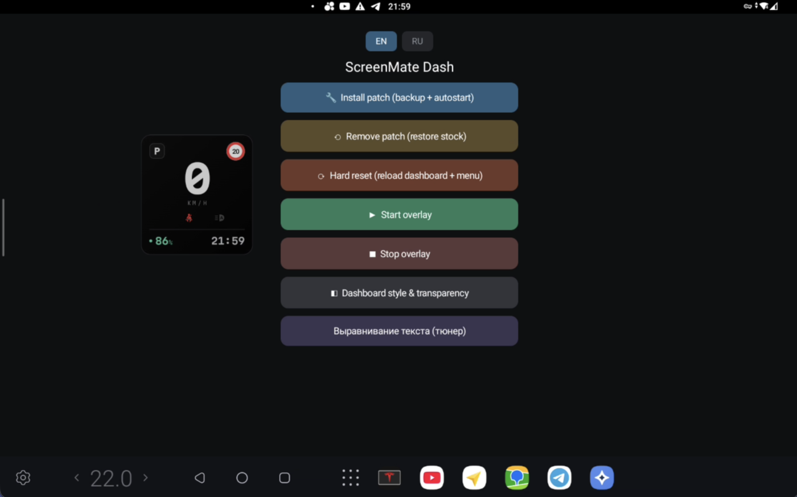
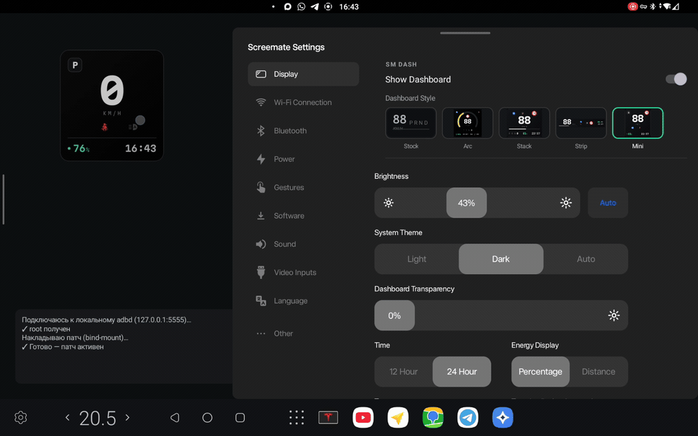

<div align="center">


# ScreenMate Dash

A custom native dashboard for the **Tesla Screenmate** box (Android 14) — a sleek speedometer
overlay that replaces the stock dashboard, fed with live vehicle data from the stock app.

</div>



## Requirements

- A **Tesla Screenmate** box running the **stock Screenmate app v1.8**. The patch is built for
  v1.8 — on other stock versions it won't apply correctly. (Check on the box: stock Settings →
  Software.)
- Install over any previous version of this app — your data and the patch are preserved
  (same signing key).

## Features

- **Five dashboard styles** — Stock, Arc, Stack, Strip, Mini.
- **5-tap ring switch** — five quick taps on the dashboard cycle
  `Stock → Arc → Stack → Strip → Mini → Stock`, round and round. No menus.
- **Live data** — speed, gear, battery, temperatures, speed limit, autopilot, turn signals,
  high beam, seatbelt — straight from the car.
- **КМ/Ч** — speed localized to km/h. 12-hour (AM/PM) clocks are supported too.
- **In-Settings panel** — a *SM DASH* block inside the stock *Display* settings: a master
  toggle, the five style thumbnails, and a **transparency** slider that controls the dashboard
  live. The highlighted style follows the active dashboard in real time.
- **Adjustable** — drag to reposition, pinch to scale (50–100 %), drag up to collapse into a strip.
- **Reversible** — *Remove patch* restores the stock dashboard; a reboot does the same, and the
  app re-applies the patch automatically on boot.
- **One-tap updates** — the *SM DASH* settings block checks for new releases and, when one is
  out, shows an **"Update to vX.Y"** button that downloads and installs it in place — no PC, no
  installer prompts. The patch re-applies itself afterwards.

## Switching dashboards



Five quick taps on whichever dashboard is showing advance to the next one.

## Install

1. **Enable ADB on the Screenmate first (one time).** The app applies the patch through the
   Screenmate's *own* local ADB, so it has to be turned on:
   - Open the Screenmate's system Settings → **About**, and tap **Build number** 7 times until it
     says *"You are now a developer."*
   - Go to **Developer options** and turn on **USB debugging**.
2. Download **SMDashPatcher.apk** from [Releases](../../releases).
3. On the Screenmate, allow installation from unknown sources and install the APK.
4. Open the app → **Install patch**.
5. A system **"Allow debugging?"** dialog appears on the Screenmate — tap
   **"Always allow from this device"** (one time; required to apply the patch).
6. Done — the custom dashboard appears.

> **"Error connecting to local adbd 127.0.0.1 on port 5555"?** That means ADB isn't on — go back
> to step 1 and enable Developer options → USB debugging, then tap *Install patch* again.

## Controls

- **5 taps** on the dashboard — cycle through the styles (see above).
- **Drag up** — collapse into a strip; pull the strip down — expand.
- **Two fingers** — scale; **drag** — reposition.
- In the stock *Display* settings — the *SM DASH* block: master toggle, style picker, transparency.

## How it works

The Screenmate's bootloader is locked (dm-verity enforcing), so the system can't be written
directly. The patched stock dashboard APK is **bind-mounted** over the live app (ephemeral) and
re-applied on every boot through the device's own local root adbd. Fully reversible.

> ⚠️ Experimental — use at your own risk. The patch is reversible, and the app re-applies it
> automatically after a reboot.

## Source & transparency

This is the full source of ScreenMate Dash — published so anyone can read exactly what it does
before installing it. Points worth verifying yourself:

- **The overlay app** is standard Kotlin + Jetpack Compose (`app/src/main/java/app/smdash/`).
  The interesting file is [`Patcher.kt`](app/src/main/java/app/smdash/Patcher.kt) — everything
  it does to your device is there.
- **No analytics, no telemetry, no tracking.** The `INTERNET` permission is used for three things,
  all visible in the source: talking to the device's **own** local root adbd over `127.0.0.1`
  (loopback) to apply the patch; checking GitHub for new releases and (only when you tap *Update*)
  downloading the release APK from this repo; and, **only when you tap *Send report***, POSTing a
  short PII-free diagnostic ([`ReportCollector.kt`](app/src/main/java/app/smdash/ReportCollector.kt)
  lists exactly what — no location, no VIN, no media). Nothing is sent in the background. A
  downloaded update is installed only after verifying it's this package signed with the same key
  ([`UpdateChecker.kt`](app/src/main/java/app/smdash/UpdateChecker.kt)).
- **What the stock-app patch changes** — every hook is documented in
  [`patch/README.md`](patch/README.md), and our injected code is right there
  ([`patch/SmdashPanel.java`](patch/SmdashPanel.java)). It's small, additive, and reversible.
- **The stock Screenmate app is NOT redistributed here** — it's proprietary. The patch is applied
  to *your own* copy on *your own* device. See [Building from source](#building-from-source).

## Building from source

```bash
git clone https://github.com/PavelDemyanov/screenmate-dash.git
cd screenmate-dash
./gradlew assembleDebug
# → app/build/outputs/apk/debug/app-debug.apk
```

Requirements: JDK 17 and the Android SDK (set `ANDROID_HOME` or create `local.properties` with
`sdk.dir=…`). The build uses Gradle 8.9 via the wrapper and AGP 8.5.

Two things are intentionally **not** in this repo, so a from-source build differs from an official
release:

- **The signing key** (`keystore/`). Official releases are signed with a pinned key so a new build
  installs straight over the old one; publishing that key would let anyone push a malicious
  install-over "update" to existing users. Without it, the build falls back to your local debug key
  — fine for building and running your own copy (you just can't upgrade an official install in
  place). Forks should sign with their own key.
- **The patched stock APK** (`app/src/main/assets/patched_stock.apk`) and the bundled **adb key**.
  A from-source build compiles and runs, but the *Install patch* step needs those assets. To make a
  working patcher you supply your own patched stock APK (see [`patch/`](patch/)) and generate an adb
  keypair (`adb keygen`) into `app/src/main/assets/adbkey[.pub]`.

## Repository layout

| Path | What |
|------|------|
| `app/src/main/java/app/smdash/` | the overlay app (Compose UI, `OverlayService`, `Patcher`) |
| `app/src/main/res/` | resources, icons, the redrawn telltale vectors, Martian Mono font |
| `patch/` | the stock-app patch: our injected code + a description of every hook |

## License

[MIT](LICENSE) — for the ScreenMate Dash source. It does **not** cover the proprietary stock
Screenmate app, which this project patches but does not redistribute. Martian Mono (in
`app/src/main/res/font/`) is under the SIL Open Font License 1.1.
